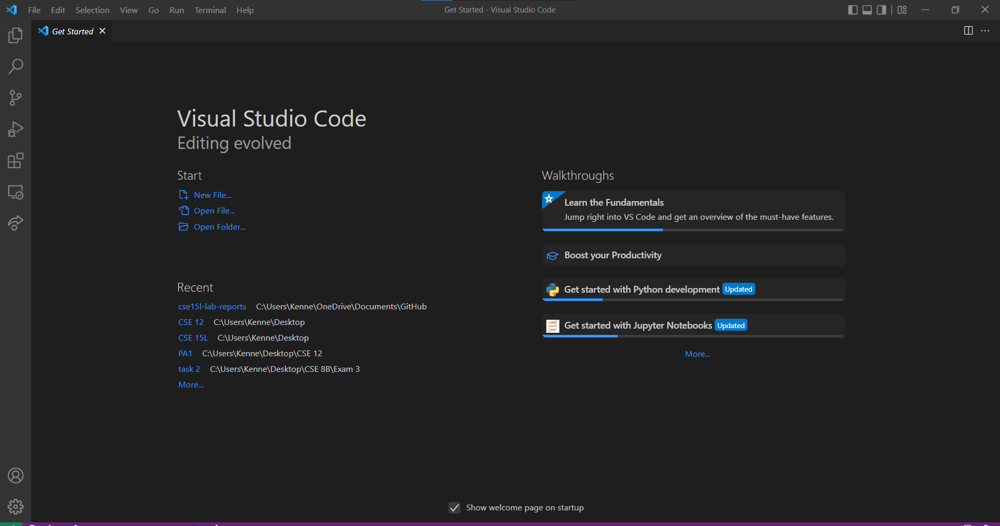

# Lab Report 1 - Week 2

Hello incoming 15L students (and myself)! Here's my journey on the very first lab of this course.

Because this is the first lab, there's going to be a ton of things to set-up before we do some magic.

# Preinstallation

Before everything happens, let's start off with getting a text editor to code. To be honest, it doesn't really matter which type of text editor you have (Elipse, VSCode, Notepad++, etc.), but for this course, we will be using **Visual Studio Code** (aka VSCode).

## Step 1
* Head to the [Visual Code Studio](https://code.visualstudio.com/download) website & download the one for your operating system!
    * Once you've ran the installation you should be able to now have the most common coding text editor in the world!
    * When you open VSCode, you should sort of see this image below (and that means you're good to go!)
    
