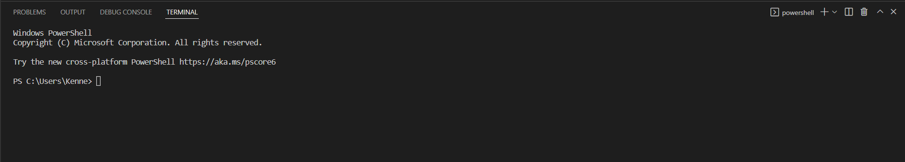

# Lab Report 1 - Week 2

Hello incoming 15L students (and myself)! Here's my journey on the very first lab of this course.

Because this is the first lab, there's going to be a ton of things to set-up before we do some magic.

&nbsp;

## Preinstallation
Before everything happens, let's start off with getting a text editor to code. To be honest, it doesn't really matter which type of text editor you have (Elipse, VSCode, Notepad++, etc.), but for this course, we will be using **Visual Studio Code** (aka VSCode...the most common coding text editor).

* Head to the [Visual Code Studio](https://code.visualstudio.com/download) website & download the one for your operating system.
    * When you open VSCode, you should sort of see this image below (and that means you're good to go!)

&nbsp;

## Connecting to a Remote Server
This is where it gets real cool but may be quite confusing. We're going to be **remotely connecting to a server and accessing it as a different device** (but only through a terminal). Think of accessing & remotely connecting to a server like *cloud gaming*.

### Step 1 - Preinstallation
* Before we connect remotely to a server, we need to make sure we have [**OpenSSH**](https://docs.microsoft.com/en-us/windows-server/administration/openssh/openssh_install_firstuse) installed on our computer. Make sure you have the two installed:
    * **OpenSSH Client**
    * **OpenSSH Server**

### Step 2 - Finding your course-specific account
* Once you have installed OpenSSH, we first need to know what your [**course-specific account**](https://sdacs.ucsd.edu/~icc/index.php) is for 15L.
    * Go to the link above and lookup your account with your *UCSD username* (without the @ucsd.edu) and *student ID*.
    
    * Once you're in, under **Additional Accounts**, you should see a button with a username of *cs15lsp22###*
        * cs15l is the course
        * sp22 is the current quarter
        * \### is your unique account
    * Just in case, you should [**change the password**](https://cdn-uploads.piazza.com/paste/ktv2gnof3sx5bf/181c3cb053df5cf1ccaf0457f56f12a2e5aa90b139aef8c2ea8fcc590f02fadf/How-to-Reset-your-Password.pdf) for that account (as for the first time, the password is randomly generated without you knowing) for you to have a more simpler password to remember.
        * Once you've changed your password, wait for about 10 - 45 minutes for the system to change the password, and you're good to go!
* *Write down your account username and password somewhere for convenience!*

### Step 3 - Connecting to the Remote Server Computer
* We're going to be connecting to one of UCSD's server computers through VSCode (ieng6).
    1. Open VSCode and open a new terminal (there's a tab up top called *Terminal*, press *New Terminal*)
        * You should now see a terminal pop-up of your operating system's main command-line (in my case, it's windows powershell)

        
    2. Within the terminal, type: **ssh username@ieng6.ucsd.edu**
        * *The username is your course-specific username!*
    3. (Optional) If in the case this is your first-time (which it probably is), you will probably get a message that denotes:
        * Authenticity of host "ieng6.ucsd.edu (IP)" can't be established.
        * RSA key fingerprint is: ~~~
        * *Are you sure you want to continue connecting?*
            * When it prompts before connecting, type **yes** and enter.
                * Afterwards, it will prompt you to enter your password, so **enter the password** you took from your *course-specific account* (your password won't display on the terminal, but it's there).
        * Once you've entered your password, you should be remotely connected to the ieng6 server!
        